# SoftEther VPN Server Tutorial

This tutorial should help you build a VPN Server using a DigitalOcean Droplet. The same steps should apply to instances 
on AWS and Azure. In case you choose to build the server on AWS or Azure, you will also need to setup the security group
and firewall settings to allow the ports that will be exposed through `ufw`. I will highlight such information within 
the steps as needed.

**Required Skills**

1. Basic knowledge of networking
2. Familiarity with Linux terminal and commands

**Cost & Benefits**

This will cost you about $5/month. The differences between this tutorial and buying VPN from a service provider are:
1. You can create unlimited number of accounts for friends and family
2. If you're a business, you can create accounts for the whole company
3. In cases where VPN providers are blocker by IP range, your Droplet is not within that range
4. In case where specific protocols are blocked, you can use SSTP or IP-over-DNS 


## Table of contents

1. Creating the Droplet
2. Performing Initial Server Setup
3. Server Hardening
4. SoftEther Server Installation
5. IPsec/L2TP Setup (SoftEther Server Administration GUI)
6. Certificate Setup
7. SSTP Setup
8. Windows Client Configuration
9. iOS Client Configuration
10. MacOS Client Configuration
11. Android Client Configuration


---
## 1. Creating the Droplet 

1. Login to [DigitalOcean](https://digitalocean.com). If you don't have an account, sign up and do the initial setup
2. [Create a new Droplet](https://cloud.digitalocean.com/droplets/new)
3. In the page that following, ensure that you select
    - Distribution: Ubuntu 18.xx (LTS)
    - Plan: Standard, $5/month (you may need a bigger droplet if you are a business)
    - Block Storage: Do not add any
    - Data Center: You may want to pick **Frankfurt** or **New York**. I'll explain when to pick which one of them below
    - Additional Options: We don't need any
    - Authentication: One-time Password
    - Finalize & Create: 1 Droplet, pick the name that you like
    - Other options can stay default
4. Click Create
5. You will receive an email with the password and the IP of the new Droplet

### Which Region Do I Pick?

For the Middle East: This depends on why you need the VPN. If you are interested in *speed only*, pick **Frankfurt**. The VPN server will make your
geolocation appear to websites and services as if it was the location of the VPN server. If you wish to *appear as if you 
are in the United States*, then pick **New York**.  

### How Does It Look Like?

> 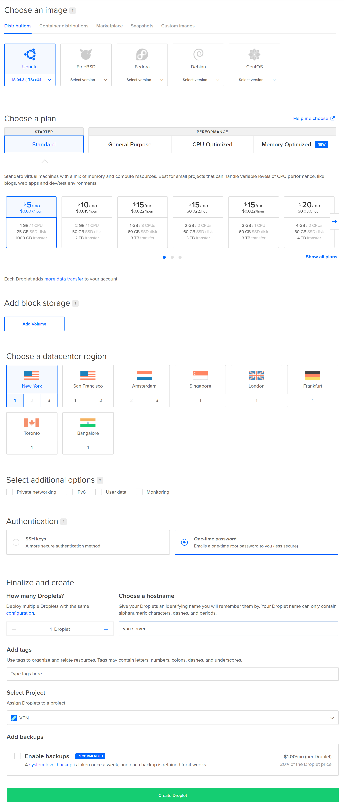

---
## 2. Performing Initial Server Setup 

In this step, we will do the following:
1. Update Ubuntu
2. Create a new user instead of the root user
3. Install Friendly Editor (optional)
4. Disable root access
5. Add swap file
6. Optimize server performance (slightly)

For the next steps, you will need a Terminal window. If you are on Windows, the easiest way to get this is to the the "Git Bash"
terminal which comes with the standard [Git for Windows](https://git-scm.com/download/win). Linux & Mac users can use the build-in 
Terminal.  

### 2.1 Update Ubuntu
In the email that I received, the IP address for my new Droplet is 161.35.1.111. In my terminal, issue the commands:  
```bash
ssh root@161.35.1.111
    # You will be asked to enter the password from the email 
    # and to create a new password.

apt update && apt -y dist-upgrade
    # When prompted to pick configuration, pick the choice to leave maintainer defaults  

reboot
```
The server will now reboot. In a few seconds, we will connect to it again in order to continue the setup

### 2.2 Create a new user instead of the root user

```bash
ssh root@161.35.1.111
adduser softether
usermod -aG sudo softether
```

We've just created a new user called softether. Let's test that we can use it instead of root. 

*OPEN A NEW TERMINAL* and then
```bash
ssh softether@161.35.1.111
sudo apt update
   # If this command works, then our new user works fine! If it doesn't review the steps above. 
   # We can now disable the root user.
```

### 2.3. Install Friendly Editor (optional)

The following step is for users with little Linux experience. If you know how to use `vim` or `nano`, you may skip 
this step and use any of them whenever we need to edit some file. I will be using `mcedit` within this document for
those who are unfamiliar with `vi` and `nano`

```bash
sudo apt install mc
``` 

### 2.4. Disable root access

Open a Terminal and ssh as root.
> DO NOT CLOSE THIS TERMINAL UNTIL THIS STEP is 100% done!* 
```bash
ssh root@161.35.1.111
ssh softether@161.35.1.111
sudo mcedit /etc/ssh/sshd_config
```
1. Press `F7` and search for `PermitRootLogin yes`
2. Change it to `PermitRootLogin no`
3. Press `F2` to save
4. Press `F10` to quit

If you made mistakes or typos, press `ESC`, do not save and try again
```bash
sudo service sshd restart
   # Leave this Window Optn
```

In a new Terminal, let's try and see if our configuration worked
```bash
ssh root@161.35.1.111
   # This should FAIL
```

```bash
ssh softether@161.35.1.111
   # This should SUCCEED
```

### 2.5. Add swap file

In this step, we'll create a swapfile, enable it and add it to `/etc/fstab` so that it's enabled by default on next reboots
```bash
sudo fallocate -l 1G /swapfile
sudo chmod 600 /swapfile
sudo mkswap /swapfile
sudo swapon /swapfile
echo '/swapfile none swap sw 0 0' | sudo tee -a /etc/fstab
```

### 2.6. Optimize server performance (slightly)

Tell Linux to us swap as little as possible
```bash
sudo sysctl vm.swappiness=10
sudo sysctl vm.vfs_cache_pressure=50
```

Let's make sure this is done automatically when the system reboots, too.
```bash
sudo mcedit /etc/sysctl.conf
```
1. scroll to the bottom and add the lines
    ```bash
    vm.swappiness = 10
    vm.vfs_cache_pressure=50
    ```
2. Press `F2` to save
3. Press `F10` to quit

---
## 3. Server Hardening

I will not go into details about the Ubuntu server hardening as there are many guides over the internet. We will just 
perform the minimal hardening which should be sufficient in most cases. 

Install `fail2ban` which will block brute force attacks 
```bash
sudo apt -y install fail2ban
```

Ensure that firewall is only allowing the ports that we need
```bash
sudo ufw allow OpenSSH
sudo ufw allow 443
sudo ufw allow 992
sudo ufw allow 1194
sudo ufw allow 5555
sudo ufw allow 500/udp
sudo ufw allow 1701/udp
sudo ufw allow 4500/udp
sudo ufw allow 1723/tcp
```

Enable the firewall

```bash
sudo ufw enable
```

Test it

```bash
sudo ufw status
```
---
## 4. SoftEther Server Installation

Let's start by installing the SoftEther server and basic commands
```bash
sudo apt-add-repository -y ppa:paskal-07/softethervpn 
sudo apt update 
sudo apt -y install softether-vpnserver
```

And start the SoftEther VPN server
```bash
sudo service softether-vpnserver start
```

Now go to [http://www.softether-download.com/en.aspx?product=softether](http://www.softether-download.com/en.aspx?product=softether) and download 
**SoftEther VPN Server Manager for Windows** without installers - if you're on Mac, you may download the Mac version. Linux users should download
the Windows version and run it with `wine`. This is how my download screen looks like after selecting the appropriate options.
> 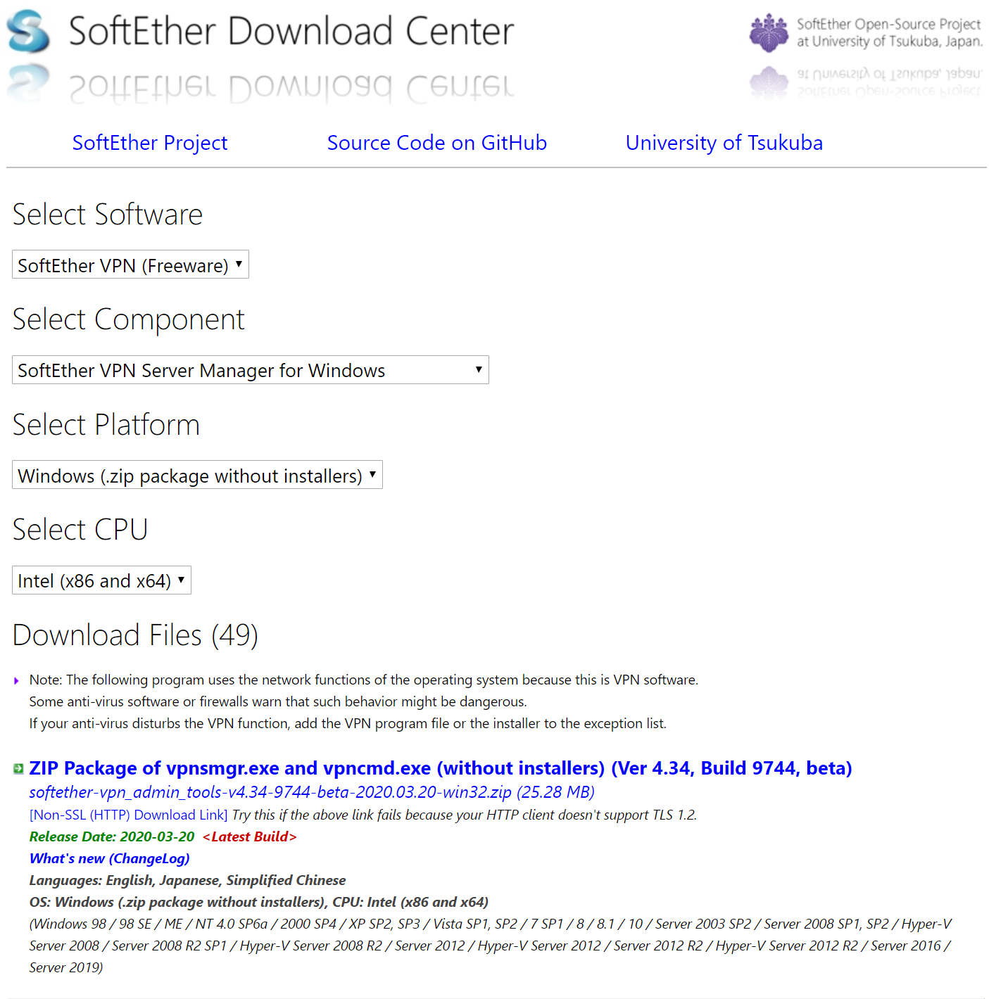   

1. Extract the zip file 
2. Run `vpnsmgr.exe`
3. Click "New Setting"
4. Enter a name for your "Setting Name" field
5. Add the IP Address of your Droplet in the "Host Name" field
6. Click OK
> 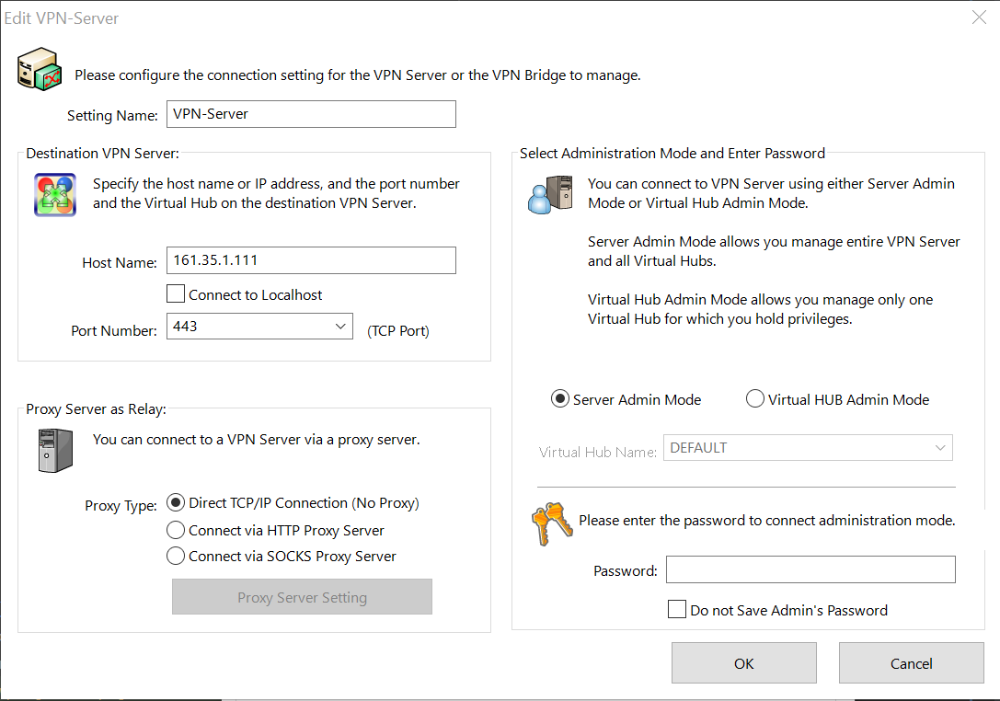

You should now return to the main screen. Click "Connect". You will be prompted to create a password for managing the 
VPN server. Please ensure that you create a secure password. Once this is done, the GUI will automatically start a configuration wizard.

---
## 5. IPSEC/L2TP Setup (SoftEther Server Administration GUI)

1. Once the Wizard starts, select the option for "Remote Access VPN Server"

    > 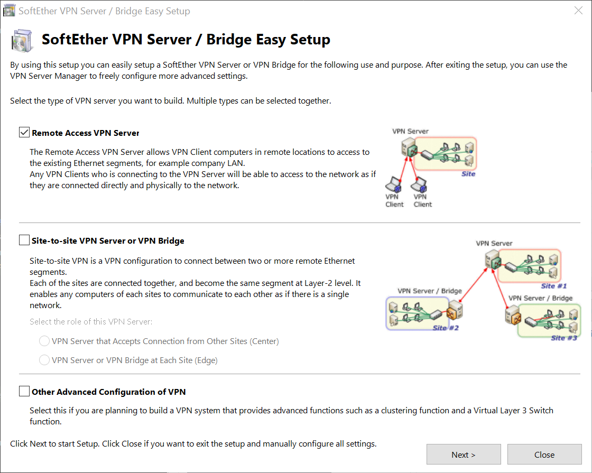

2. The wizard will ask you to initialize a HUB, press OK and enter the hub name

    > 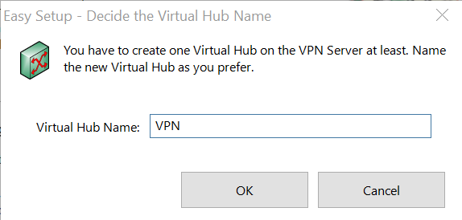

3. The wizard will show the Dynamic DNS function. You may enter an easy name for you server for you to remember 
if you wish. You can do this later, too. Click "Exit" when you're done

    > 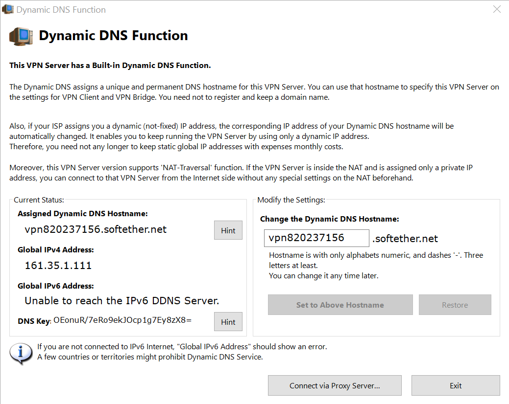

4. IPsec/L2TP/EtherIP/.. screen will appear. 
    1. Check the "Enable L2TP Server Function (L2TP over IPSec)". 
    2. Ensure that all other check boxes are **unchecked**
    3. Note the IPsec Pre-shared key at the bottom. You can change it now or later if you wish
    
    > 

5. VPN Azure Service: Click "Disable VPN Azure" and then click "OK"
 
    > 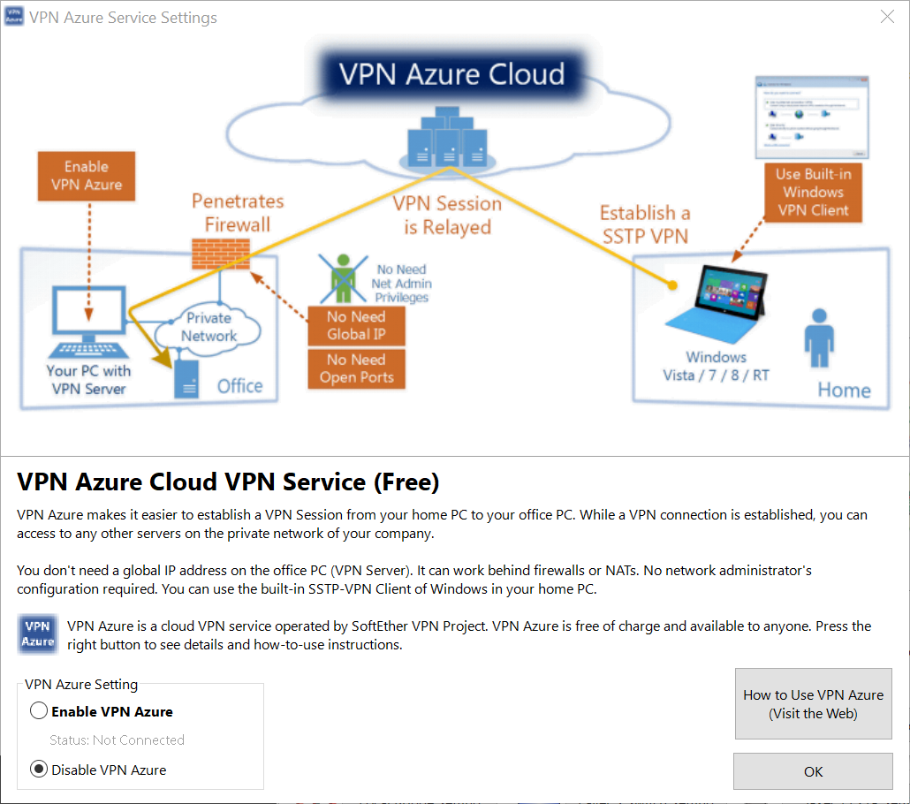

6. VPN Easy Setup Tasks
    1. Click "Create Users"
        1. In "User Name": Enter username for connection
        2. In "Password": Enter password for this user
        3. Click OK
    2. In Set Local Bright, ensure that "eth0" is selected and press OK
    
    > 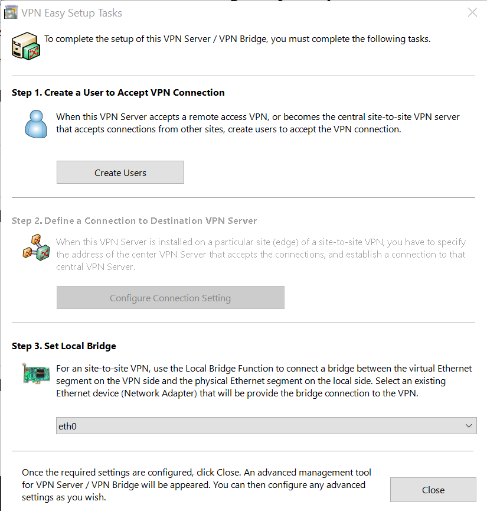
  
    3. You may receive a warning regarding Promiscuous Mode. You can safely ignore this warning.
     
    > 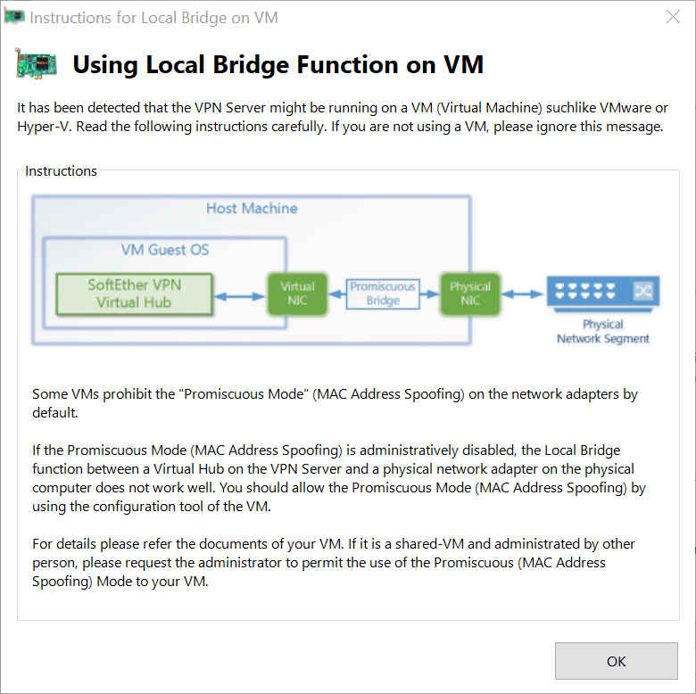
 
7. All done

    > 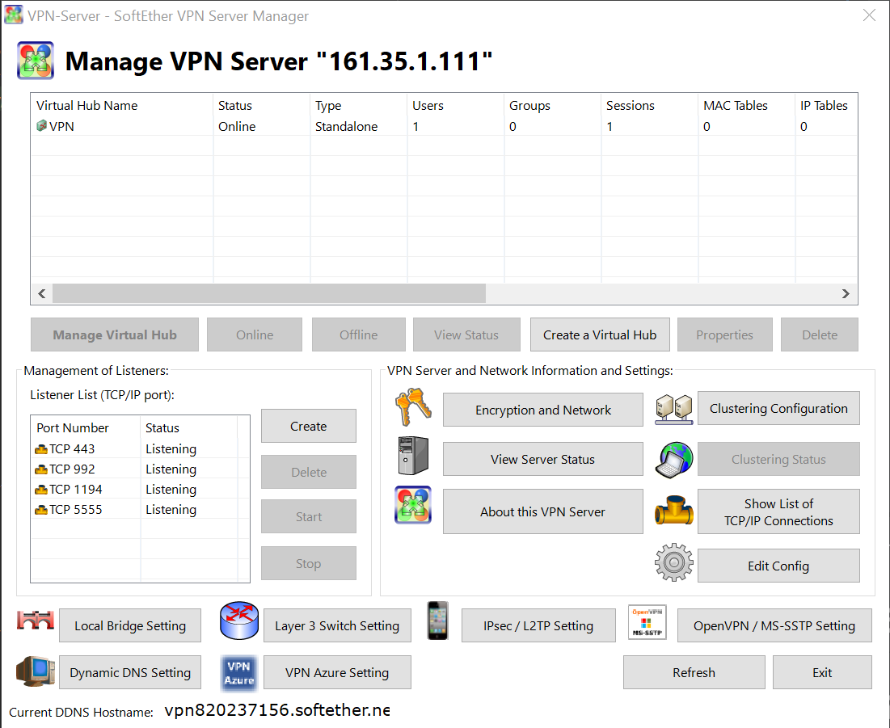

8. Click "Manage Virtual Hub"

    > 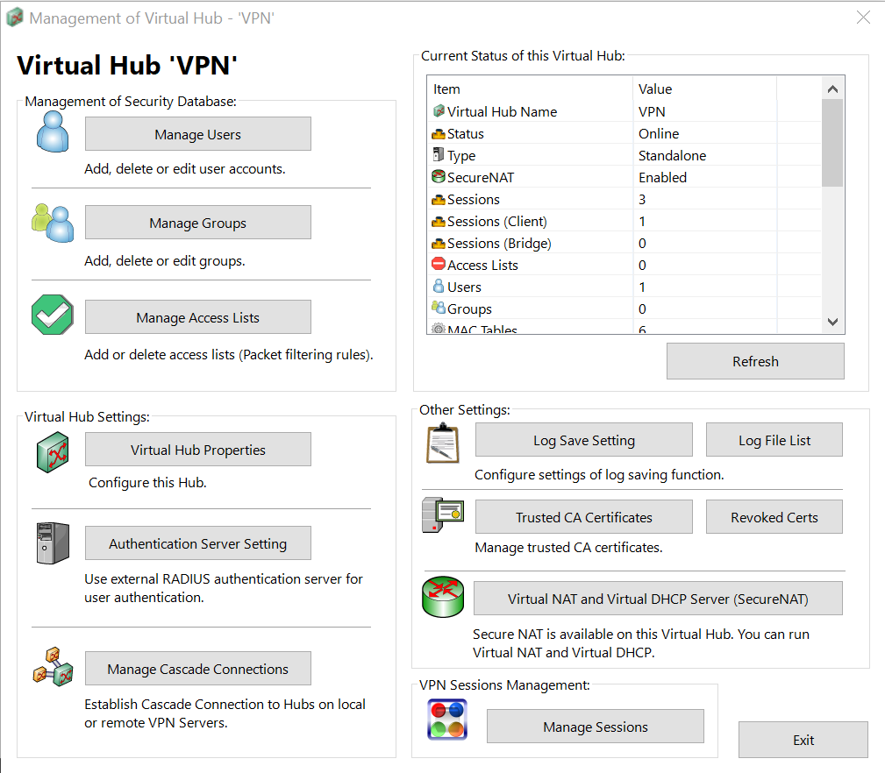

9. Click "Virtual NAT and Virtual DHCP Server (Secure NAT)"
    1. In this screen, click "Enable SecureNAT"
    
    > 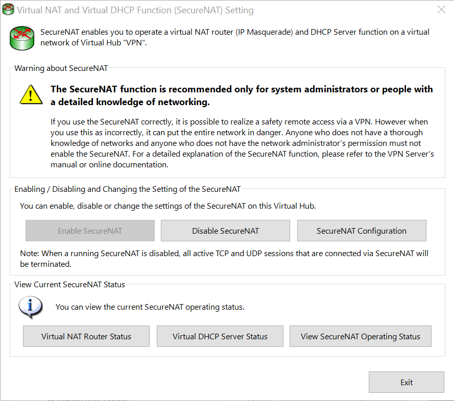

10. You're all set

---
##  6. Certificate Setup

The hostname that I got assigned is `vpn225930509.softether.net`. You can check yours from the GUI by clicking 
"Dynamic DNS Setting" in the "Virtual HUB Manager" (Step 5.7)

We will also need a valid email address. Let's use this value in the commands below. 

```bash
sudo apt -y install certbot
sudo ufw allow http 

# Then run the command
# sudo certbot certonly --standalone -n -d (your host name) --agree-tos --email "(your email address)"

# In this example, I ran the following command
sudo certbot certonly --standalone -n -d vpn225930509.softether.net --agree-tos --email "(my email address)"
```

The results were two files in:
```bash
/etc/letsencrypt/live/vpn225930509.softether.net/fullchain.pem
/etc/letsencrypt/live/vpn225930509.softether.net/privkey.pem
``` 

> NOTE:  **YOUR PATH WILL BE DIFFERENT. IT WILL BE BASED ON YOUR HOSTNAME** 
> 
>The format is:
>
>   `/etc/letsencrypt/live/< HOST NAME >/fullchain.pem`
>
>   `/etc/letsencrypt/live/< HOST NAME >/privkey.pem`

Let's load those two files:

```bash
vpncmd localhost:5555 /server /CMD ServerCertSet /LOADCERT:/etc/letsencrypt/live/vpn225930509.softether.net/fullchain.pem /LOADKEY:/etc/letsencrypt/live/vpn225930509.softether.net/privkey.pem
```

Let's Encrypt will provide us with a three month certificate. Let's ensure that we renew in time... 

```bash
sudo mcedit /etc/cron.monthly/renew_cert.sh
```

1. Copy and paste the text into the file and replace the missing fields.
    ```bash
    #!/bin/sh
    certbot renew
    vpncmd localhost:5555 /server /PASSWORD:[*** YOUR SERVER PASSWORD ***] /CMD ServerCertSet /LOADCERT:/etc/letsencrypt/live/[*** YOUR SERVER NAME ***]/fullchain.pem /LOADKEY:/etc/letsencrypt/live/[*** YOUR SERVER NAME ***]/privkey.pem
    ```
2. Press `F2` to save
3. Press `F10` to exit

Let's test the renewal script
```bash
chmod +x /etc/cron.monthly/renew_cert.sh
/etc/cron.monthly/renew_cert.sh
```
The script should run and say that
1. The cert doesn't need to be updated.
2. The cert (in this case, the one that currently exists) has been loaded.
If this is the case, your server is ready to be used with SSTP and even current L2TP/IPSec is also using the new "real" cert..

---
## 7. SSTP Setup

In the main script for Server Manager, click "OpenVPN / MS-SSTP Setting". It should open the following screen

   > 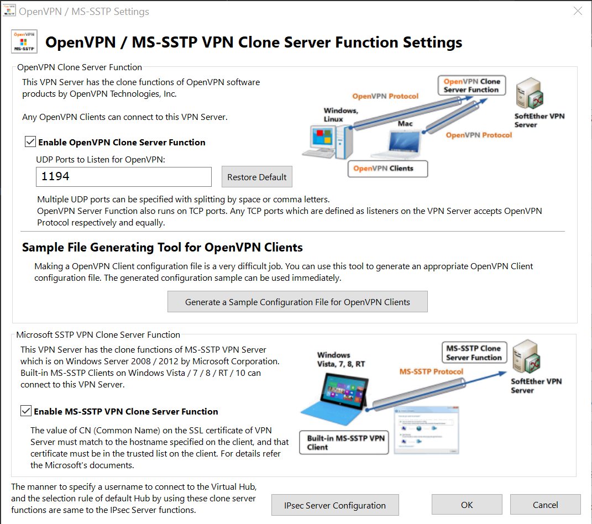

Ensure the "Enable MS-SSTP VPN Clone Server Function" is checked and click OK. You can now use this from Windows 7 and above
by simply changing the connection type to Automatic. 

   > Note: When you connect from Windows, you must use the hostname instead of the IP so that SSL verification doesn't fail
   > Note for Mac users: There are multiple SSTP clients available for download that you can use with this feature. 

---
## 8. Windows 10 Client Configuration
1. Open Network and Internet Settings

2. Click VPN

3. Click "Add a VPN Connection" 

    > 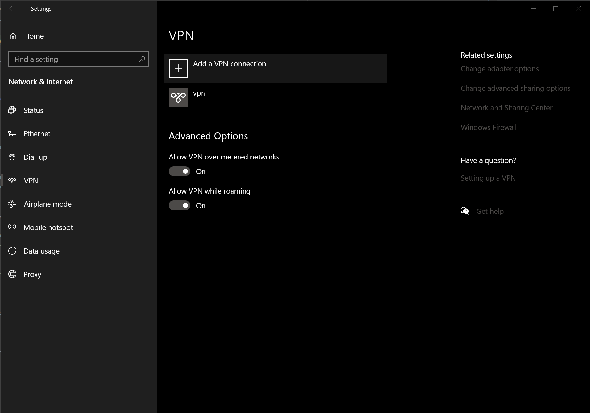
    
4. Ensure that you select VPN type "L2TP/IPsec with pre-shared key" and enter the details for the connection
   1. Pre-shared key (from step 5.4)
   2. Username: Same username that you created (from step 5.6)
   2. Password: Same password that you created (from step 5.6)
   
    > 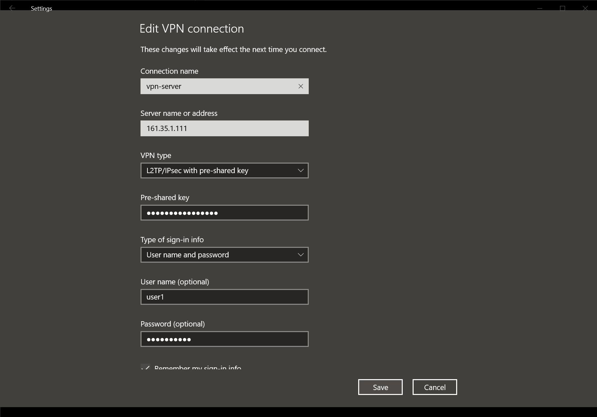
    
5. Click "Save"

6. Click the connection and click "Connect"

    > 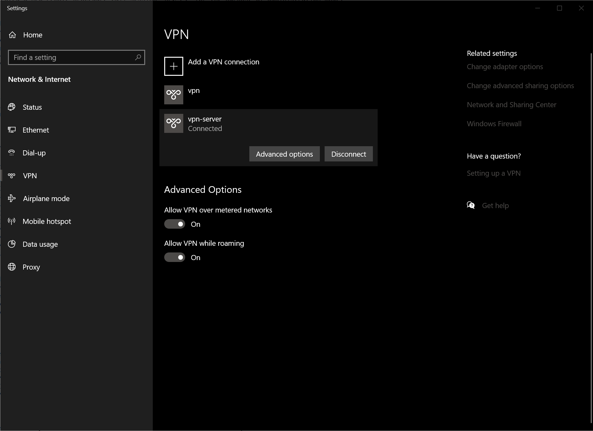

---
## 9. iOS Client Configuration
1. Open the Settings App, tap "VPN" and tap "Add VPN Configuration"

    > 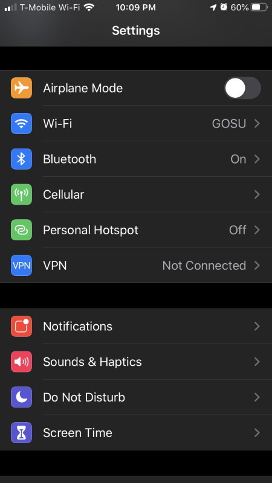

2. Tap "Type" to change the VPN type

    > 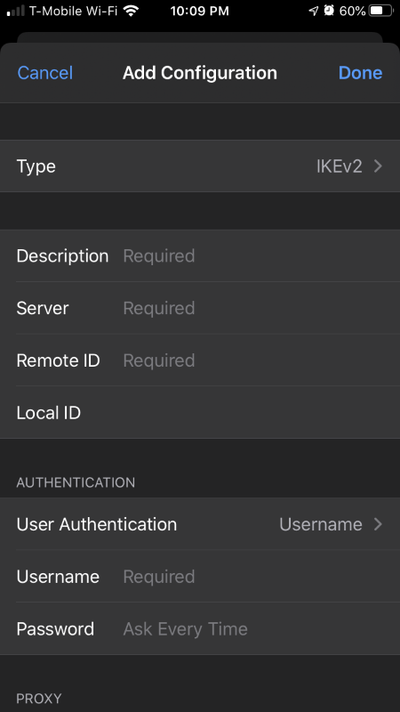

3. Tap "L2TP" to select L2TP as the connection type

    > 

4. Enter the connection details
    1. Description: Name of the connection
    2. Server: IP Address of the server (or hostname)
    3. Account: Username from step 5.6
    4. RSA SecureID: off
    5. Password: Password from step 5.6
    6. Secret: Pre-shared key from step 5.4
    
    > 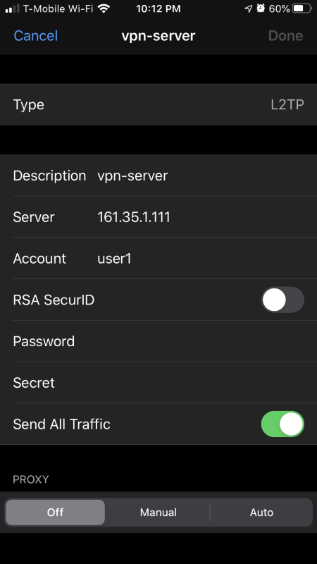
    
---
## 10. MacOS Client Configuration
1. Open the Network Settings and click the "+" sign at the bottom. 
    1. Interface: VPN
    2. VPN Type: L2TP over IPSec
    3. Service Name: Type in the connection name

    > 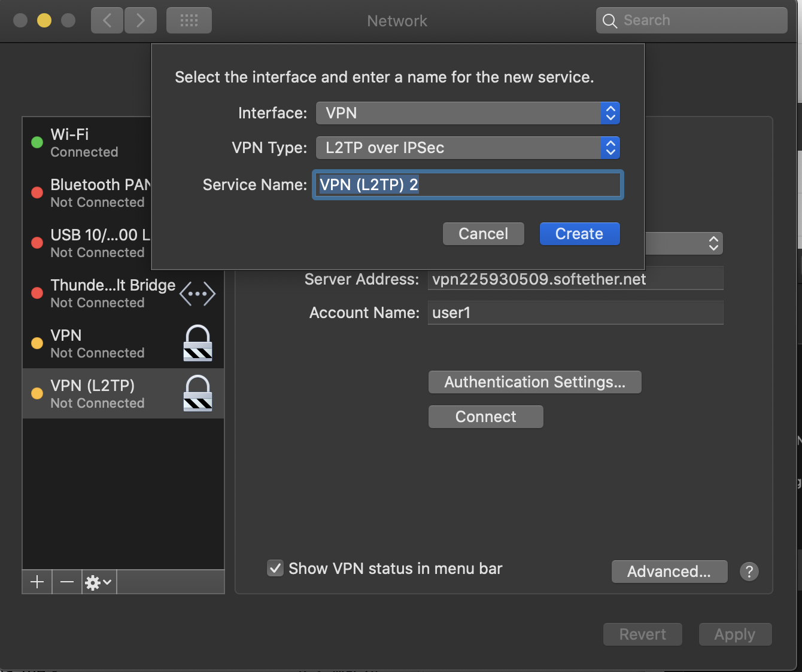

2. In the Connection settings:
    1. Server Address: Put in the hostname or IP address
    2. Account Name: Username from step 5.6
    3. Click "Authentication Settings"

    > 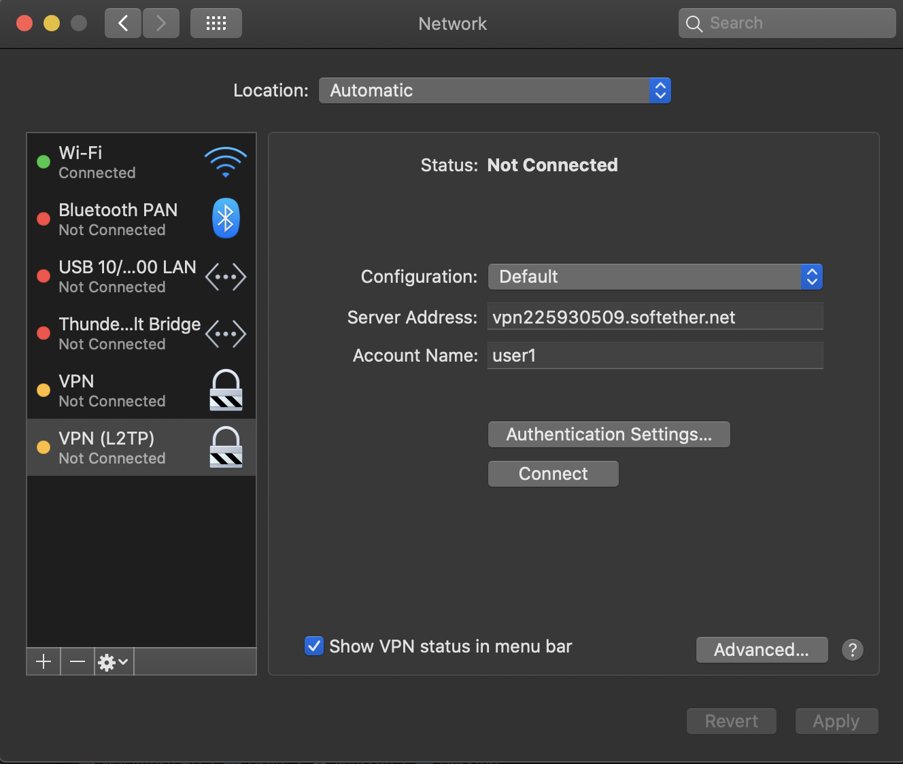

3. In the Authentication Settings Screen
    1. Enter the password from step 5.6
    2. Shared Secret: Pre-shared key from step 5.4

    > 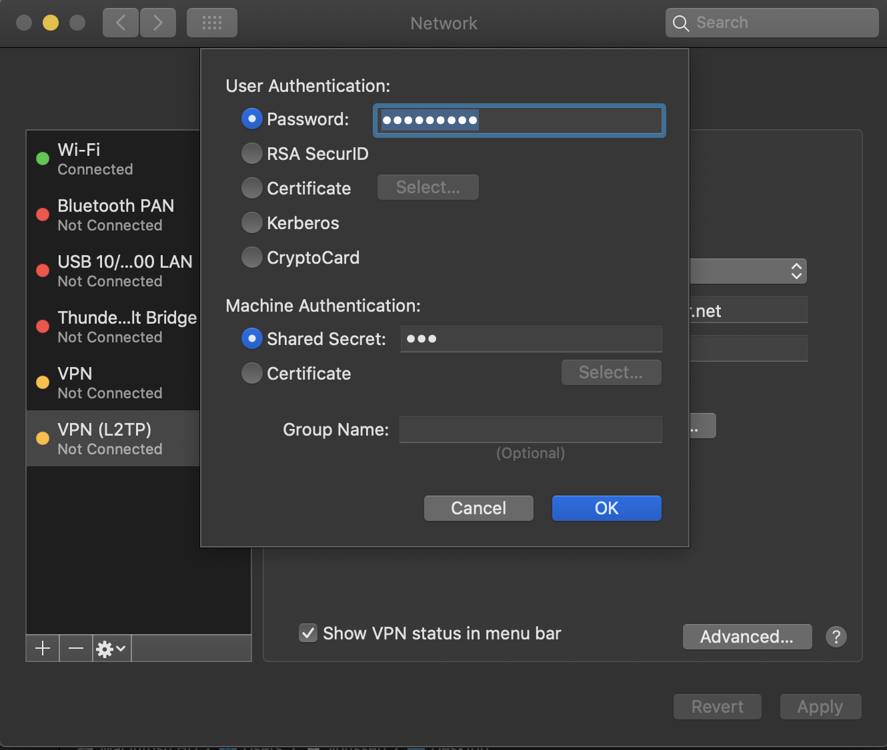

4. Click Apply
5. Click Connect

---
## 11. Android Client Configuration
TODO
